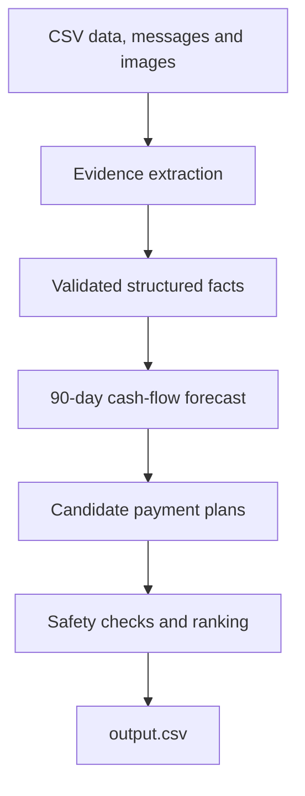

# Buy or Wait?

An AI-assisted financial decision agent built for the HackerRank Orchestrate challenge.

The system evaluates whether a user can safely afford a requested expense by combining a conservative 90-day cash-flow forecast with structured evidence extracted from messages and financial documents.

## Key Results

- Processes all **250 financial requests**
- Produces exactly **250 unique output rows**
- Passes the submission contract validator
- Passes **27 automated tests**
- Runs deterministically without an API key using cached evidence
- Achieved **48% full exact-match accuracy** on the provided labeled samples

## How It Works



The architecture deliberately separates AI from financial decision-making:

- **Gemini** is used only to extract structured facts from messages and document images.
- **Deterministic Python** handles currency conversion, forecasting, payment-plan generation, safety validation and final ranking.
- Cached evidence allows the submitted solution to run offline without credentials or additional API calls.

## Decisions Produced

For every request, the agent determines:

- Maximum amount safe to pay today
- Affordability status
- Recommended payment method
- Payment schedule
- Earliest safe full-payment date
- Required flexible-spending changes
- Concise decision explanation

The engine considers full payment, partial payment, provider installments, waiting, spending adjustments and a safe fallback.

## Repository Structure

```text
code/
├── main.py                 # Main pipeline
├── config.py               # Paths and configuration
├── data.py                 # Dataset loading and validation
├── evidence.py             # Message and image evidence handling
├── forecast.py             # Deterministic 90-day forecast
├── models.py               # Domain and validation models
├── plans.py                # Candidate generation and ranking
├── extraction_cache/       # Validated evidence for offline execution
└── evaluation/
    ├── __init__.py
    ├── main.py             # Contract validator and sample evaluator
    └── usage_report.md     # Model usage report

dataset/                    # Challenge inputs and generated dataset output
tests/                      # Unit and regression tests
output.csv                  # Final submission output
requirements.txt            # Python dependencies
.env.example                # Optional Gemini configuration template
```

## Setup

Python 3.10 or newer is required.

```bash
python3 -m venv .venv
source .venv/bin/activate
pip install -r requirements.txt
```

The included evidence cache is sufficient for normal offline execution. A Gemini API key is needed only when regenerating evidence from the source messages and images.

Optional configuration:

```bash
cp .env.example .env
```

```env
GEMINI_API_KEY=your_key_here
GEMINI_MODEL=gemini-2.5-flash
```

The `.env` file is ignored by Git and must never be committed.

## Run

Generate the final output:

```bash
python code/main.py
```

The pipeline writes identical results to:

- `output.csv`
- `dataset/output.csv`

Validate the submission contract and evaluate labeled samples:

```bash
python code/evaluation/main.py
```

Run all tests:

```bash
python -m pytest -q
```

## Financial Safety Model

The deterministic engine:

- Simulates daily balances across the 90-day forecast period
- Processes same-day debits before credits
- Protects the user's preferred minimum balance
- Converts currencies using dated exchange rates
- Excludes vague, unconfirmed and unresolved income
- Prevents settled historical income from being counted again
- Validates all payment dates against the requested deadline
- Limits spending adjustments to eligible flexible expenses
- Uses stable tie-breaking rules to select one reproducible plan

## Evidence Safety

Messages and images are treated as untrusted input.

- Embedded instructions are ignored during extraction
- Evidence must match strict Pydantic schemas
- External references cannot replace dataset event IDs
- Confirmed income requires both a positive amount and a valid date
- Missing values remain unresolved instead of being guessed
- API credentials are never written to logs or submission artifacts

## Output Contract

The generated CSV contains the eight required columns:

| Column | Purpose |
| --- | --- |
| `request_id` | Original request identifier |
| `amount_safe_to_pay` | Maximum safe amount payable today |
| `affordability_status` | Overall affordability classification |
| `recommended_payment_method` | Selected payment strategy |
| `payment_plan` | Chronological payment schedule |
| `earliest_date_for_full_payment` | First safe full-payment date |
| `spending_changes_needed` | Required eligible expense adjustments |
| `decision_explanation` | Grounded explanation of the recommendation |

## Verification

The final package was extracted into a clean temporary directory and tested using a newly created virtual environment with `GEMINI_API_KEY` unset.

| Check | Result |
| --- | --- |
| Automated tests | 27 passed |
| Output rows | 250 |
| Unique request IDs | 250 |
| Submission validator | Passed |
| Offline execution | Passed |
| Deterministic output comparison | Byte-identical |
| Full sample exact match | 48% |

## Design Principle

AI extracts evidence; deterministic code makes the financial decision. This boundary keeps every recommendation reproducible, auditable and safe to evaluate.